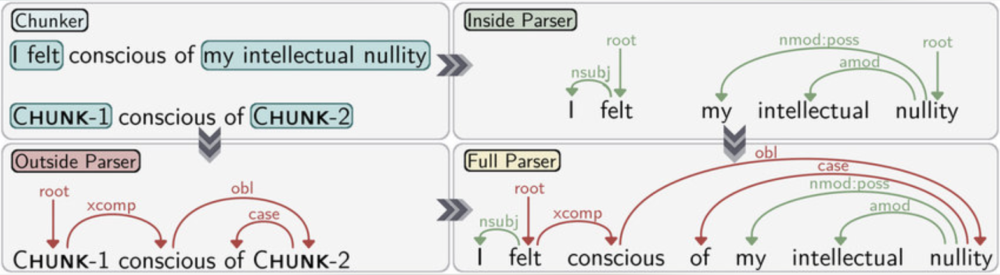

### Visualizing Chunking vs. Full Parsing

The following diagram illustrates the difference between chunking and full parsing for the sentence:

*I felt conscious of my intellectual nullity.*

- **Chunker (Top-Left):** The sentence is divided into non-overlapping chunks, such as [I felt] and [my intellectual nullity]. Each chunk is a meaningful group, but the internal structure of each chunk is not shown.
- **Inside Parser (Top-Right):** Shows the grammatical relationships within a single chunk.
- **Outside Parser (Bottom-Left):** Shows how chunks relate to each other, but not the internal structure.
- **Full Parser (Bottom-Right):** Shows all grammatical relationships in the sentence, both within and between chunks.

**Chunking** is useful for quickly identifying the main building blocks of a sentence, while **full parsing** provides a complete syntactic analysis. In this experiment, you will focus on building a chunker and understanding how different features and training data sizes affect its performance.

---

### Theory: Building a Chunker in NLP

**Chunking in NLP**

Chunking, also known as shallow parsing, is the process of dividing a sentence into its constituent parts, such as noun phrases (NP), verb phrases (VP), and prepositional phrases (PP). Unlike full parsing, chunking does not produce a complete syntactic tree, but instead identifies non-overlapping, non-recursive groups of words that form meaningful units. These chunks help in various downstream NLP tasks, such as information extraction and question answering.

**Why is Chunking Important?**

Chunking simplifies the structure of sentences, making it easier to analyze and extract information. For example, identifying all noun phrases in a sentence can help in extracting entities or subjects.

**Machine Learning Approaches to Chunking**

In this experiment, we use two popular sequence modeling algorithms to build a chunker:

#### Hidden Markov Model (HMM)

HMMs are probabilistic models that predict the most likely sequence of labels (such as chunk tags) for a given sequence of words. They use the probabilities of transitions between states (tags) and the likelihood of observing a word given a tag. HMMs are effective for tasks where the context of neighboring words is important, such as part-of-speech tagging and chunking.

#### Conditional Random Field (CRF)

CRFs are a type of discriminative probabilistic model used for structured prediction. Unlike HMMs, CRFs can consider a wider range of features and dependencies in the data, making them more flexible and often more accurate for tasks like chunking. CRFs can incorporate information from the entire input sequence, not just local context.

**Role of Features and Corpus Size**

- *Feature Selection*: The choice of features (such as lexical features, part-of-speech tags, or a combination) greatly affects the model's ability to correctly identify chunks. Richer feature sets often lead to better performance.
- *Training Corpus Size*: Larger training corpora provide more examples for the model to learn from, generally resulting in higher accuracy. However, there are diminishing returns as the corpus size increases.

**What You Will Learn in This Experiment**

- How to build a chunker using HMM and CRF algorithms.
- How different features (lexical, POS, or both) impact chunking accuracy.
- How increasing the size of the training corpus affects model performance.
- How to interpret chunked output and accuracy results through interactive simulation.

This experiment provides a hands-on, visual approach to understanding the key factors that influence chunking in NLP, helping you make informed decisions when designing your own NLP models.

#### Hidden Markov Model 

In the mid 1980s, researchers in Europe began to use Hidden Markov models (HMMs) to disambiguate parts of speech. HMMs involve counting cases, and making a table of the probabilities of certain sequences. For example, once you've seen an article such as 'the', perhaps the next word is a noun 40% of the time, an adjective 40%, and a number 20%. Knowing this, a program can decide that "can" in "the can" is far more likely to be a noun than a verb or a modal. The same method can of course be used to benefit from knowledge about following words.

More advanced ("higher order") HMMs learn the probabilities not only of pairs, but triples or even larger sequences. So, for example, if you've just seen an article and a verb, the next item may be very likely a preposition, article, or noun, but much less likely another verb.

When several ambiguous words occur together, the possibilities multiply. However, it is easy to enumerate every combination and to assign a relative probability to each one, by multiplying together the probabilities of each choice in turn.

It is worth remembering, as Eugene Charniak points out in Statistical techniques for natural language parsing, that merely assigning the most common tag to each known word and the tag "proper noun" to all unknowns, will approach 90% accuracy because many words are unambiguous.

HMMs underlie the functioning of stochastic taggers and are used in various algorithms. Accuracies for one such algorithm (TnT) on various training data is shown here.

#### Conditional Random Field

Conditional random fields (CRFs) are a class of statistical modelling method often applied in machine learning, where they are used for structured prediction. Whereas an ordinary classifier predicts a label for a single sample without regard to "neighboring" samples, a CRF can take context into account. Since it can consider context, therefore CRF can be used in Natural Language Processing. Hence, Parts of Speech tagging is also possible. It predicts the POS using the lexicons as the context.

In this experiment both algorithms are used for training and testing data. As the size of training corpus increases, it is observed that accuracy increases. Further, even features also play an important role for better output. In this experiment, we can see that Parts of Speech as a feature performs better than only lexicon as the feature. Therefore, it is important to select proper features for training a model to have better accuracy. 